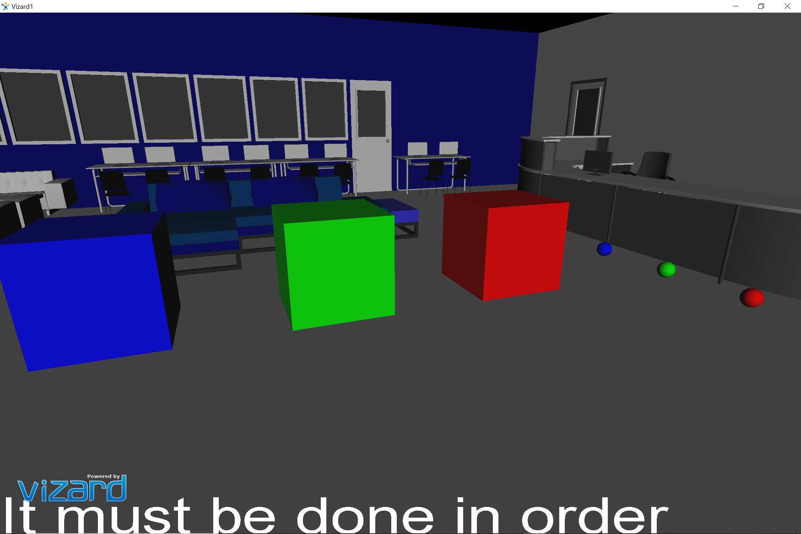

# EscapeTheLab
Escape Room Game 

This is an escape game coded in python using vizard. 

Vizconnect.py: This allows the directional movement and grabbing of the character. 
Vizard1.py : Source Code for Gameplay. 

Goal: To open the door by solving a puzzle

Puzzle: The game was set to have multiple computer science puzzles. So far ive coded one. The balls must be placed on their respective platforms in a specific order. Most is the CS field know that RGB is the standard order regarding colors. 

Game in Action: The working game. The door is oper after completing the puzzle. 

Enjoy!
